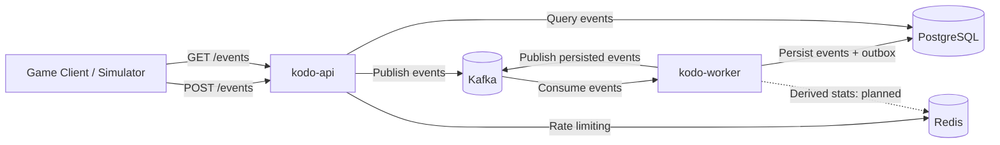

# Kodo

> An event-driven backend platform for ingesting, storing, and querying game telemetry.

**Kodo** is a backend portfolio project focused on asynchronous processing, PostgreSQL transactions, Kafka delivery semantics, Redis rate limiting, and testing. The name comes from the Japanese **kodō (鼓動)**, meaning *heartbeat* or *pulse*.

The project stays deliberately manageable: each architectural decision solves a concrete problem and should be understandable end to end.

## Current Status

Implemented:

- Event ingestion with `202 Accepted` after Kafka confirms publication.
- PostgreSQL event storage and filtered, paginated reads.
- Redis token-bucket rate limiting on ingestion.
- Duplicate handling using a database constraint on `(game_id, event_id)`.
- Consumer retries and dead-letter handling.
- Transactional Outbox MVP: atomic event/outbox writes, scheduled publication, and publication tracking.
- Unit tests and PostgreSQL/Redis integration tests.
- Manual end-to-end verification of the outbox flow.

**Next:** an idempotent Stats Projector consuming persisted-event notifications and maintaining derived statistics in Redis. Statistics endpoints, automated CI/CD, and AWS/Terraform deployment are not implemented yet.

## Architecture



Solid arrows show implemented interactions; the dashed arrow shows planned statistics processing. Kafka represents the broker, with separate topics: the API publishes `GameEvent` to `telemetry.events`, and the worker publishes `GameEventPersisted` to `telemetry.events.persisted`. Failed ingestion records are routed to `telemetry.events-dlt` according to the worker's retry policy.

The consumer and outbox scheduler run inside **the same `kodo-worker` application**, with separate execution paths. PostgreSQL is the durable source of truth: the event and its outbox entry are committed in one transaction. The scheduler later reads pending entries and marks them published after successful Kafka publication; the detailed failure behaviour is described in **Transactional Outbox** below.

Redis currently holds ingestion rate-limit state. The planned Stats Projector will run in the worker, consume persisted-event notifications, and maintain derived Redis statistics. It and the statistics read endpoints are not implemented yet.

| Module / directory | Responsibility |
| --- | --- |
| `kodo-api` | HTTP ingestion, rate limiting, Kafka publication, event queries |
| `kodo-worker` | Kafka consumption, validation, persistence, retries, DLT, outbox publication |
| `kodo-contracts` | Shared `GameEvent` and `GameEventPersisted` records |
| `db/migration` | Flyway SQL migrations |
| `docker-compose.yml` | Local PostgreSQL, Flyway, Kafka, and Redis |

Application services depend on input/output ports; Kafka, PostgreSQL, Redis, HTTP, and scheduling adapters live under infrastructure packages. Shared contracts simplify coordination, but contract changes still need compatibility consideration between producers and consumers.

## Technology Stack

| Technology | Current use |
| --- | --- |
| Java 25 / Spring Boot 4.1.1 | API and worker |
| Maven Wrapper | Multi-module builds and tests |
| Apache Kafka 4.0.0 image | Local event broker |
| PostgreSQL 17 | Events and outbox |
| Redis 8 Alpine image | Ingestion rate limiting |
| Flyway | Schema migrations; Compose currently uses `flyway/flyway:latest` |
| Docker Compose | Local infrastructure |
| JUnit, AssertJ, Mockito, Testcontainers | Unit and integration tests |

GitHub Actions, AWS, and Terraform remain roadmap items.

## Local Development

### Prerequisites

- JDK 25, selected in the IDE and available to the Maven Wrapper.
- Docker with Docker Compose and a running Docker daemon.
- Free local ports `8080`, `9092`, `5434`, and `6379`.

Commands below run from the repository root in **PowerShell**. On Linux/macOS, use `./mvnw` in place of `.\mvnw.cmd` and adapt the HTTP examples to your shell.

### Start infrastructure

```powershell
docker compose up -d
docker compose logs flyway
docker compose ps
```

Wait for Flyway to finish successfully before starting the applications. A completed Flyway container is expected: it runs migrations and exits. Both applications use `ddl-auto: validate`; they do not create the runtime schema themselves.

| Service | Host address |
| --- | --- |
| PostgreSQL | `localhost:5434`, database/user/password: `kodo` |
| Kafka | `localhost:9092` |
| Redis | `localhost:6379` |
| API | `http://localhost:8080` unless overridden |

These are local development settings. The Compose Kafka listener advertises `localhost:9092` for applications running on the host; containerizing the applications will require listener/address changes.

### Start applications

Import the root `pom.xml` into IntelliJ, select JDK 25, and run:

- `com.kodo.api.KodoApiApplication`
- `com.kodo.worker.KodoWorkerApplication`

Alternatively, build the executable JARs (Docker must be running for integration tests):

```powershell
.\mvnw.cmd package
```

Then run each application in its own terminal:

```powershell
java -jar kodo-api/target/kodo-api-0.0.1-SNAPSHOT.jar
```

```powershell
java -jar kodo-worker/target/kodo-worker-0.0.1-SNAPSHOT.jar
```

**Compose starts infrastructure only, not the API or worker.** Keep one worker with the outbox scheduler enabled for this MVP.

The API and worker declare the ingestion and DLT topics respectively, each with one partition and replication factor one. The persisted-event topic has no explicit `NewTopic` bean yet. To provision it explicitly for the local test:

```powershell
docker compose exec kafka /opt/kafka/bin/kafka-topics.sh --bootstrap-server localhost:9092 --create --if-not-exists --topic telemetry.events.persisted --partitions 1 --replication-factor 1
```

### Configuration

Application settings are in each module's `src/main/resources/application.yaml` and can be overridden through Spring configuration/environment variables.

| Setting | Application | Default |
| --- | --- | --- |
| `kodo.rate-limit.enabled` | API | `true` |
| `kodo.rate-limit.capacity` | API | `10` tokens |
| `kodo.rate-limit.refill-rate` | API | `2` tokens/second |
| `kodo.outbox.enabled` | Worker | `true` |
| `kodo.outbox.poll-interval-ms` | Worker | `1000` |
| `kodo.outbox.batch-size` | Worker | `100` |

The outbox interval is a fixed delay **after the previous execution completes**, not a guarantee of 100 events per second. Kafka publication time also contributes to throughput.

## HTTP API

### POST /events

```json
{
  "eventId": "7f4d6e1b-1d50-4c31-b273-c779831f5230",
  "gameId": "demo-game",
  "playerId": "player-123",
  "type": "PLAYER_DIED",
  "occurredAt": "2026-09-07T10:00:00Z",
  "payload": { "damage": 100 }
}
```

`eventId` and `occurredAt` are required; `gameId` and `type` must be nonblank. `playerId` and `payload` are optional; a missing payload is stored as an empty object. Event types are currently strings, without an enforced enum or event-specific payload schema.

- `202 Accepted`, empty body: Kafka publication completed; PostgreSQL persistence and downstream processing may still be pending.
- `400 Bad Request`: malformed input or request validation failure.
- `429 Too Many Requests`, empty body and `Retry-After` header: rate limit exceeded.

The rate limiter uses an atomic Redis Lua token bucket, keyed by the supplied `gameId`, consuming one token per ingestion attempt. If Redis fails, it logs the error and **fails open**, allowing ingestion. Authentication/API keys are not implemented; `gameId` is caller-controlled and is not a trusted client identity.

### Send a test event

```powershell
$eventId = [guid]::NewGuid().ToString()
$body = @{
    eventId = $eventId
    gameId = "outbox-test"
    playerId = "player-123"
    type = "PLAYER_DIED"
    occurredAt = [DateTime]::UtcNow.ToString("o")
    payload = @{ damage = 100 }
} | ConvertTo-Json -Depth 5

$response = Invoke-WebRequest -Uri "http://localhost:8080/events" -Method Post -ContentType "application/json" -Body $body -UseBasicParsing
$response.StatusCode
$eventId
```

Keep this terminal open: later SQL commands use its `$eventId` variable. Repeating the POST with the same `gameId` and `eventId` does not create another stored event or outbox entry; it is not an update operation.

### GET /events

| Parameter | Meaning | Default / limits |
| --- | --- | --- |
| `gameId` | Optional game filter | Omitted: no game filter |
| `playerId` | Optional player filter | Omitted: no player filter |
| `type` | Optional event-type filter | Omitted: no type filter |
| `page` | Zero-based page | `0`, minimum `0` |
| `size` | Page size | `20`, from `1` to `100` |

Filters can be combined. Results are ordered by `occurredAt DESC, id DESC`, using the internal row ID as a tie-breaker.

```powershell
Invoke-RestMethod -Uri "http://localhost:8080/events?gameId=outbox-test&type=PLAYER_DIED&page=0&size=20" | ConvertTo-Json -Depth 8
```

The response contains `items`, `page`, `size`, `totalElements`, and `totalPages`. Each item contains `eventId`, `gameId`, `playerId`, `type`, `occurredAt`, `receivedAt`, and `payload`. An immediate read after a POST may not yet include the new event.

There are no batch-ingestion or statistics endpoints yet.

## Kafka and Failure Handling

| Topic | Producer | Consumer / purpose | Key |
| --- | --- | --- | --- |
| `telemetry.events` | API | Worker, group `telemetry-storage` | Currently unset |
| `telemetry.events-dlt` | Worker error recoverer | Failed-record inspection; no replay consumer implemented | Original record key |
| `telemetry.events.persisted` | Worker outbox publisher | Future Stats Projector | `gameId` |

The API waits for its publication future before returning 202 and configures `acks: all`. The storage consumer disables Kafka auto-commit; Spring's listener container manages offsets. There is no application-level manual acknowledgement in the listener.

The worker configures a one-second fixed backoff with three retries for retryable processing failures before dead-letter recovery. `InvalidEventException` is explicitly non-retryable. The recoverer targets the original partition in the DLT and is configured to fail recovery if DLT publication fails. The worker producer supports both raw bytes and JSON event objects, including `GameEventPersisted`.

Consumer error-handler retries and outbox retries are separate mechanisms. The outbox scheduler does not send failed publications to the ingestion DLT.

## Transactional Outbox

The outbox bridges the gap between storing an event and publishing a notification that it was stored:

1. `EventProcessingService` validates the incoming event inside a PostgreSQL transaction.
2. The event repository inserts with duplicate handling. Only a new event creates an outbox row.
3. Event and outbox writes commit together; an outbox insertion failure rolls back the event insertion.
4. `OutboxScheduler` invokes `OutboxPublisherService` through the `OutboxProcessor` port.
5. The service selects rows with `published_at IS NULL`, ordered by `created_at, id`, up to the configured batch size.
6. Each row becomes a `GameEventPersisted` notification. Publication waits for the Kafka send result with `.get()`.
7. After successful publication, a separate database update sets `published_at`.

Example notification:

```json
{
  "eventId": "7f4d6e1b-1d50-4c31-b273-c779831f5230",
  "gameId": "demo-game",
  "eventType": "PLAYER_DIED"
}
```

| Failure | Behaviour |
| --- | --- |
| Event/outbox transaction fails | Both writes roll back |
| Worker stops after that transaction commits | Pending notification remains in PostgreSQL |
| Publication fails | Current row remains pending; remaining batch processing stops |
| Publication succeeds, but marking fails or the worker stops before marking | Notification may be published again |

The design permits **at-least-once publication**, not exactly-once processing. Recovery depends on fixing persistent failures and resuming the publisher. The future projector must deduplicate using the event identity, scoped by game, before changing aggregates.

## Persistence

Flyway migrations are the schema source of truth:

| Migration | Purpose |
| --- | --- |
| `V1__create_events_table.sql` | `events`: UUID primary key, event/game/player metadata, timestamps, JSONB payload, unique `(game_id, event_id)` |
| `V2__add_events_game_occurred_at_index.sql` | Index on `(game_id, occurred_at DESC, id DESC)` for game-scoped ordered reads |
| `V3__create_outbox_events_table.sql` | `outbox_events`, unique `(game_id, event_id)`, and partial pending index on `(created_at, id) WHERE published_at IS NULL` |

The outbox row `id` identifies the publication record; `event_id` identifies the original event. Published outbox rows are retained. The read index targets game-scoped queries and does not imply that every other filter has a dedicated index.

## Testing

With Docker running, execute the suite from the root:

```powershell
.\mvnw.cmd test
```

Run the two outbox-related service test classes and required reactor modules:

```powershell
.\mvnw.cmd -pl kodo-worker -am "-Dtest=EventProcessingServiceIntegrationTest,OutboxPublisherServiceTest" "-Dsurefire.failIfNoSpecifiedTests=false" test
```

Existing coverage includes:

- API service and controller behaviour, rate-limit rejection, filters, and pagination.
- PostgreSQL queries, ordering, and duplicate handling with Testcontainers.
- Redis bucket exhaustion and refill with Testcontainers.
- Kafka error-handler retry/recovery behaviour using test doubles.
- Atomic event/outbox persistence, duplicate suppression, and rollback.
- Outbox notification conversion, publish-before-mark ordering, and stopping after publication failure.
- Ordered and limited selection of pending outbox rows.

Publisher unit tests mock the publication port; they do not validate real Kafka serializer wiring. The manual flow below complements them. Broker-backed serialization coverage and automated full E2E coverage remain future work.

### Manual outbox verification

With infrastructure and both applications running, open another terminal:

```powershell
docker compose exec kafka /opt/kafka/bin/kafka-console-consumer.sh --bootstrap-server localhost:9092 --topic telemetry.events.persisted --from-beginning
```

Send the example POST above. In the **same terminal used for the POST**, run:

```powershell
docker compose exec postgres psql -U kodo -d kodo -c "SELECT event_id FROM events WHERE game_id = 'outbox-test' AND event_id = '$eventId'; SELECT event_id, published_at FROM outbox_events WHERE game_id = 'outbox-test' AND event_id = '$eventId';"
```

Success means one event row, one outbox row with a non-null `published_at`, and a notification in the consumer terminal with the same `eventId`, `gameId`, and expected `eventType`. Allow time for asynchronous processing. `--from-beginning` also displays retained older messages; match the UUID. Stop the diagnostic consumer with `Ctrl+C`.

This flow was manually verified during Outbox MVP development, including recovery of a pending row after correcting a serializer configuration error and restarting the worker, without resending the POST.

If a row stays pending, check the worker log for `Outbox publishing cycle failed`, confirm scheduling is enabled, and inspect the underlying exception. Full-context persistence tests disable the scheduler with `kodo.outbox.enabled=false` to avoid background publication during assertions.

## Known Limitations

- **One active outbox publisher.** Multiple enabled workers may select the same rows. Row claiming/leases are deferred until parallel publication is needed.
- **Duplicates remain possible**, including with one publisher when publication succeeds before marking fails. The Stats Projector is not yet implemented and must be idempotent.
- **Persistent failures block progress from the failing row.** No outbox attempt limit, quarantine, or exponential backoff exists yet.
- **No outbox cleanup policy** is implemented.
- **Local infrastructure is not highly available.** One broker and replication factor one provide no broker redundancy; only PostgreSQL has an explicit named data volume in Compose.
- **No authentication or authorization** is implemented. Rate limiting uses caller-supplied game IDs and fails open on Redis errors.
- **Persisted notifications are minimal.** They contain event ID, game ID, and event type, but no player ID or payload. Player-specific projections will require a deliberate contract extension or a lookup.
- **Topic provisioning and image pinning are incomplete.** The persisted topic is not declared in application code, Redis uses a floating major-version tag, and Flyway uses `latest`.

## Roadmap

- [x] API/worker skeleton and local infrastructure.
- [x] HTTP ingestion, Kafka consumption, and PostgreSQL storage.
- [x] Shared contracts and required-field validation.
- [x] Filtered, paginated event reads and a game-scoped query index.
- [x] Redis ingestion rate limiting.
- [x] Duplicate handling, consumer retries, and dead-letter recovery.
- [x] Transactional Outbox MVP and manual delivery verification.
- [ ] Idempotent Stats Projector and derived Redis statistics.
- [ ] Statistics read endpoints and a strategy to rebuild/reconcile derived state.
- [ ] Broker-backed serialization tests and automated full E2E coverage.
- [ ] Targeted load testing and observability improvements.
- [ ] GitHub Actions, application container images, and CI/CD.
- [ ] AWS/Terraform deployment and teardown.

## Design Principles

Keep the ingestion path small, durable state in PostgreSQL, and derived state rebuildable. Make transaction boundaries and failure modes explicit. Add services, infrastructure, and abstractions only when a concrete requirement justifies them.
