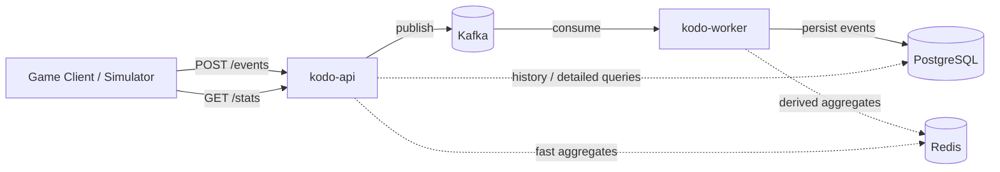

# Kodo

> An event-driven backend platform for ingesting, processing, storing, and querying game telemetry.

**Kodo** is a backend portfolio project focused on production-oriented concepts such as distributed systems, asynchronous processing, event-driven architecture, Kafka, PostgreSQL, Redis, containers, testing, CI/CD, and Infrastructure as Code.

The name comes from the Japanese **kodō (鼓動)**, meaning *heartbeat* or *pulse* — a fitting metaphor for a continuous stream of events flowing through a system.

> [!NOTE]
> Kodo is currently in its initial design and implementation phase. This README describes the intended architecture and will evolve alongside the project.

## Overview

A game can generate a large stream of telemetry events: weapon usage, kills, deaths, collected items, match lifecycle events, and more.

Instead of making the HTTP request wait for persistence and analytics work, Kodo keeps the ingestion path small:

1. `kodo-api` receives and validates an event.
2. The event is published to Kafka.
3. The API returns `202 Accepted` once the event has been accepted for asynchronous processing.
4. `kodo-worker` consumes the event.
5. The worker persists durable data in PostgreSQL.
6. Derived statistics can be maintained in Redis for fast reads.

This separation allows ingestion and processing to evolve and scale independently while introducing real distributed-systems problems in a controlled way.

## Architecture



Only `kodo-api` and `kodo-worker` contain application code. Kafka, PostgreSQL, and Redis are supporting infrastructure and will run locally through Docker Compose.

## Core Components

### `kodo-api`

A Spring Boot application responsible for the synchronous HTTP boundary of the system.

Planned responsibilities:

- Expose telemetry ingestion endpoints such as `POST /events`.
- Validate incoming requests and event metadata.
- Assign or validate an `eventId` used for idempotency.
- Publish accepted events to Kafka.
- Return `202 Accepted` without waiting for downstream processing.
- Expose read endpoints for player, weapon, and match statistics.
- Query Redis and/or PostgreSQL depending on the type of data requested.

### `kodo-worker`

A separate Spring Boot application responsible for asynchronous processing.

Planned responsibilities:

- Consume telemetry events from Kafka.
- Deserialize and validate the internal event contract.
- Apply processing logic based on event type.
- Persist events and processed data in PostgreSQL.
- Update derived aggregates in Redis where useful.
- Handle acknowledgement, retries, duplicate delivery, and failed messages as the project evolves.

## Technology Stack

| Technology | Purpose |
| --- | --- |
| Java + Spring Boot | API and worker applications |
| Apache Kafka | Durable event stream between producers and consumers |
| PostgreSQL | Durable persistence and relational queries |
| Redis | Fast access to derived statistics and selected cached data |
| Docker Compose | Reproducible local environment |
| GitHub Actions | Automated build and test pipeline |
| AWS | Later deployment phase |
| Terraform | Later Infrastructure as Code phase |

Technologies are added only when they solve a concrete problem. Kodo is intentionally not designed as a collection of technologies added for their own sake.

## Example Event

```http
POST /events
Content-Type: application/json
```

```json
{
  "eventId": "7f4d6e1b-1d50-4c31-b273-c779831f5230",
  "eventType": "WEAPON_FIRED",
  "userId": "user-123",
  "matchId": "match-456",
  "timestamp": "2026-07-29T10:34:15Z",
  "data": {
    "weaponId": "ak47",
    "shots": 1
  }
}
```

The base event contains common metadata while `data` holds event-specific fields. The contract can later evolve toward more strongly typed payloads if that becomes useful.

Initial event types may include:

- `WEAPON_FIRED`
- `PLAYER_KILLED`
- `PLAYER_DIED`
- `ITEM_PICKED`
- `MATCH_STARTED`
- `MATCH_FINISHED`

## Event Flow

The first end-to-end vertical slice is intentionally small:

```text
POST /events
    |
    v
 kodo-api
    |
    v
   Kafka
    |
    v
kodo-worker
    |
    v
PostgreSQL
```

Redis, advanced idempotency, retries, load testing, and cloud deployment are added only after this path works reliably and is covered by tests.

## Kafka Model

The initial Kafka setup is deliberately simple:

| Concept | Initial choice |
| --- | --- |
| Topic | `telemetry.events` |
| Producer | `kodo-api` |
| Consumer group | `telemetry-storage` |
| Consumer | `kodo-worker` |
| Message key | Initially `userId` or `matchId`, based on ordering requirements |
| Partitions | Start small and increase when concurrency tests justify it |

A future independent consumer group could process the same event stream for analytics or another concrete use case without interfering with the storage consumer.

## Persistence

PostgreSQL is the durable source of truth for telemetry data.

An initial generic event table may look conceptually like this:

```text
telemetry_event
----------------------------------------------------------
id              UUID        PRIMARY KEY
event_id        UUID        UNIQUE NOT NULL
event_type      VARCHAR     NOT NULL
user_id         VARCHAR     NOT NULL
match_id        VARCHAR     NULL
event_timestamp TIMESTAMP   NOT NULL
received_at     TIMESTAMP   NOT NULL
payload         JSONB       NOT NULL
```

The unique `event_id` is also a useful building block for idempotent processing when Kafka redelivers an event.

Redis is not a replacement for PostgreSQL. It is intended for derived data that benefits from fast repeated reads, for example:

```text
weapon:ak47:shots      -> 1342921
weapon:ak47:kills      -> 241098
player:user-123:kills  -> 328
```

## Planned API

| Method | Endpoint | Purpose |
| --- | --- | --- |
| `POST` | `/events` | Ingest one telemetry event |
| `POST` | `/events/batch` | Later: ingest multiple events in one request |
| `GET` | `/players/{playerId}/stats` | Query aggregated player statistics |
| `GET` | `/weapons/{weaponId}/stats` | Query weapon statistics |
| `GET` | `/matches/{matchId}` | Query match information or summary |
| `GET` | `/health` | API health check |

The first implementation will focus on `POST /events` rather than building every endpoint immediately.

## Planned Repository Structure

```text
kodo/
|
|-- kodo-api/
|   |-- src/main/java/...
|   |-- src/test/java/...
|   `-- pom.xml
|
|-- kodo-worker/
|   |-- src/main/java/...
|   |-- src/test/java/...
|   `-- pom.xml
|
|-- kodo-contracts/          # optional shared event contracts
|   `-- pom.xml
|
|-- infrastructure/
|   `-- terraform/           # later AWS phase
|
|-- docker-compose.yml
|-- .github/workflows/
`-- README.md
```

A shared contracts module is optional. It reduces friction between the API and worker, but also creates coupling between independently deployable applications, so that trade-off will be revisited as the project grows.

## Reliability Topics

Kodo will deliberately introduce production-style failure scenarios after the basic pipeline works:

- Duplicate events and idempotent processing.
- Consumer failure after a database write.
- Retry and acknowledgement strategies.
- Invalid events and dead-letter handling.
- Consumer lag and backpressure under load.
- Ordering guarantees and Kafka partition keys.
- Redis unavailability and graceful degradation.
- Slow PostgreSQL queries, indexing, and batching.
- Consistency between durable state and derived Redis aggregates.

The goal is to solve these problems because they become observable, not to prematurely build every production mechanism into the first version.

## Known Limitations and Future Improvements

### Outbox publisher coordination

The current outbox publisher assumes a single active publisher instance. If multiple worker instances poll the outbox concurrently, they may read and publish the same pending event.

This does not affect correctness because downstream consumers are designed to be idempotent, but it can cause unnecessary duplicate work and Kafka traffic.

If horizontal scaling of the outbox publisher becomes necessary, row claiming should be introduced, for example using PostgreSQL `FOR UPDATE SKIP LOCKED` or a lease-based mechanism, so different workers process different batches of pending events.

## Testing Strategy

The planned test coverage includes:

- Unit tests for validators, mappers, and event processors.
- REST integration tests for `kodo-api`.
- Kafka integration tests for serialization and producer/consumer behaviour.
- PostgreSQL integration tests for persistence.
- Redis integration tests for derived aggregates.
- End-to-end tests from `POST /events` to eventual persistence/statistics.
- Later load tests to measure throughput, latency, and consumer lag.

## Roadmap

- [x] **Phase 0 - Skeleton:** monorepo, both Spring Boot applications, Docker Compose, Kafka, PostgreSQL, and health checks.
- [x] **Phase 1 - Vertical slice:** `POST /events` -> Kafka -> `kodo-worker` -> PostgreSQL.
- [x] **Phase 2 - Contracts:** event types, validation, stable serialization, and tests.
- [x] **Phase 3 - Reads:** basic query endpoints backed by PostgreSQL.
- [ ] **Phase 4 - Redis:** derived player/weapon aggregates and optimized reads.
- [ ] **Phase 5 - Reliability:** idempotency, retries, and failed-message handling.
- [ ] **Phase 6 - Performance:** batch ingestion, consumer batching, load testing, and metrics.
- [ ] **Phase 7 - CI/CD:** GitHub Actions for builds, tests, and container images.
- [ ] **Phase 8 - AWS/Terraform:** reproducible cloud deployment and teardown using Infrastructure as Code.
- [ ] **Phase 9 - Optional extension:** a second consumer group for a justified analytics, anti-cheat, or experimental use case.

## Design Principles

Kodo follows a few intentionally simple rules:

- Start with a working vertical slice before adding infrastructure complexity.
- Keep the synchronous ingestion path short.
- Treat PostgreSQL as durable state and Redis as derived/optimized state.
- Keep API and worker responsibilities separate because they have different workloads and scaling needs.
- Prefer a small number of well-defined services over unnecessary microservices.
- Add technologies only when there is a concrete problem they solve.
- Make failure behaviour, consistency, and trade-offs explicit and testable.
- Keep the project small enough to understand and defend end to end.

## Local Development

The target local environment is:

```text
kodo-api
kodo-worker
Kafka
PostgreSQL
Redis
```

All services will run as separate processes/containers while remaining reproducible on a single development machine through Docker Compose.

Once the initial environment is implemented, the intended entry point will be:

```bash
docker compose up
```

Detailed setup, configuration, example requests, and troubleshooting instructions will be added as the implementation becomes concrete.

## Project Goals

Kodo is primarily a learning and portfolio project. By the end of the MVP, it should demonstrate more than a conventional synchronous CRUD API:

- HTTP API design.
- Event-driven and asynchronous processing.
- Kafka producers, consumers, partitions, offsets, and consumer groups.
- SQL persistence and derived Redis data.
- Idempotency and failure handling.
- Containerized local development.
- Automated testing and CI/CD.
- Performance reasoning and horizontal scaling.
- Cloud deployment and Infrastructure as Code.

Most importantly, every architectural decision should be understandable, observable, and defensible rather than added only to make the system appear more complex.
